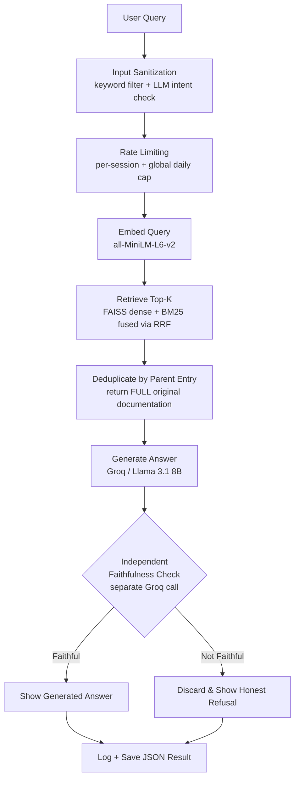

# RAG System — Python Standard Library Documentation


A retrieval-augmented generation system built from first principles, with a specific focus on **verified correctness** at every stage not just "it retrieves and generates," but retrieval that's been stress-tested, and generation whose faithfulness is independently checked rather than trusted on the model's own word.

**[Live demo]((https://python-rag-scratch.streamlit.app/))** &nbsp;

---

## Overview

This system answers natural-language questions about Python's standard library by retrieving relevant real documentation and generating a grounded answer from it with a critical twist: the generator's own claim that "the context was sufficient" is **not trusted at face value**. A second, independent LLM call verifies whether the answer is actually supported by the retrieved text, and overrides the generator when it isn't.

This project was built the same way as a from-scratch ML system would be hand-implementing the core retrieval mechanisms first (DOM-aware chunking, parent-document retrieval, hybrid search) before reaching for higher-level abstractions, and treating every "it looks correct" result with the same skepticism that caught real bugs throughout development.

---

## Results Summary

| Metric | Result |
|---|---|
| Corpus | 18 Python stdlib modules, 690 indexed vectors |
| Entry-level recall@3 | 100% (12/12 answerable eval questions) |
| Entry-level recall@1 | 83.3% — revealed a gap invisible to source-level recall alone |
| Faithfulness override | Caught and corrected a real hallucination (verified 3x reproducibly) |
| False positive rate (override on correct answers) | 0/12 — batch-verified |
| Retrieval ablation | Dense, BM25, hybrid, and RRF compared head-to-head; RRF resolved all 3 known failure cases |
| Automated tests | 23/23 passing |

---

## Architecture



---

## The Core Design Decision: Don't Trust Self-Reported Sufficiency

Early testing revealed that asking a generator to self-assess "was my context sufficient?" in the same call that produced the answer is unreliable a model grading its own work has no genuine outside perspective. A query about Python's `lambda` syntax retrieved `functools.reduce`'s documentation (which merely *uses* a lambda in an example, without explaining lambda syntax at all). The generator confidently claimed sufficiency and fabricated a textbook-correct but ungrounded answer.

**Fix:** a second, independently-framed LLM call (`verify_faithfulness`) checks whether the answer's specific claims are traceable to the retrieved text with no pressure to produce a "useful" result. When the two disagree, the independent check wins, and the system shows an honest refusal instead of the generator's unverified claim. This was reproduced and confirmed across multiple test runs, and batch-validated to produce **zero false positives** on 12 genuinely answerable questions.

<details>
<summary><b>See the actual before/after JSON output</b></summary>

**Before the fix — hallucination goes uncaught:**
```json
{
  "answer": "A Python lambda function is defined using the lambda keyword followed by an expression, e.g. lambda x: x**2.",
  "context_sufficient": true,
  "faithfulness_check": {
    "faithful": false,
    "evidence": "no supporting text found"
  }
}
```

**After the fix — independent check overrides the generator:**
```json
{
  "model_response": { "context_sufficient": true },
  "faithfulness_check": { "faithful": false, "evidence": "no supporting text found" },
  "final_answer": "The retrieved context does not contain sufficient information to answer this question. (Independent verification overrode the generator's own claim of sufficiency.)",
  "self_report_disagreement": true
}
```

</details>

---

<details>
<summary><b>Chunking: Why DOM Structure, Not Flattened Text</b></summary>

An early approach tried to infer chunk boundaries from plain text (pattern-matching short, space-free lines as likely function names). This broke constantly — code examples were mistaken for entries, summary tables merged unrelated content, and multi-line attribute names split incorrectly.

**Fix:** Python's documentation (Sphinx-generated) already marks every function/class/attribute with an unambiguous HTML tag (`<dl class="py function">`, with the exact name in a `<dt id="...">` attribute). Chunking now reads this structure directly from the raw HTML, before any text-flattening — no guessing required. Nested entries (e.g. `partial.args` inside `partial`) are correctly kept attached to their parent rather than split out as disconnected fragments.

</details>

<details>
<summary><b>Retrieval: The Parent-Document Pattern</b></summary>

The embedding model (`all-MiniLM-L6-v2`) has a hard 256-token limit — text beyond that is silently truncated, with no error. Long documentation entries exceeded this, meaning part of their content never contributed to their own searchability.

**Fix:** oversized entries are split into smaller pieces *only for embedding/matching purposes*. Every piece retains a reference to the **complete original text**. When any piece matches a query, the full original entry is returned — so even if the specific fragment that matched wasn't the most informative part, the complete, correct context still reaches the generator.

</details>

<details>
<summary><b>Retrieval Ablation: Dense vs. BM25 vs. Hybrid vs. RRF</b></summary>

A systematic comparison against a hand-curated 15-question eval set (exact-lookup, paraphrase, multi-concept, ambiguous, and deliberately unanswerable categories):

| Method | Behavior observed |
|---|---|
| Dense (embedding) | Strong overall, but occasionally over-weighted semantic similarity over literal relevance |
| BM25 (keyword) | Fixed cases dense missed, but failed entirely on vocabulary-mismatched vague queries (zero literal term overlap) |
| Hybrid (score-averaged) | One method's overconfident wrong match could outrank the other's correct answer — score scales aren't directly comparable across methods |
| **Reciprocal Rank Fusion** | Combines by rank position, not score magnitude — resolved all three known failure cases without regressing working queries |

This ablation also surfaced a stopword-removal tradeoff: unconditional stopword stripping fixed some queries but broke a short, vague one ("How does caching work?") by leaving too few tokens for BM25 to match against. Fixed with conditional removal (only strip stopwords if enough content tokens remain).

</details>

<details>
<summary><b>Evaluation Methodology</b></summary>

- **Source-level recall** (did we find the right *file*?) looked like a clean 100% — but this metric hides real weakness in large, chunk-dense files.
- **Entry-level recall** (did we find the right *specific documented item*?) revealed recall@1 was actually 83.3%, with two questions where a related-but-incorrect entry outranked the correct one at the top position (both still succeeded by recall@3).
- **Batch faithfulness validation**: ran the full eval set through the independent verification layer, confirming zero false positives on answerable questions and correct interception of the one known hallucination case.

</details>

---

## Production Hardening

| Concern | Implementation |
|---|---|
| Index rebuild cost | Corpus content is hashed; index loads from disk cache unless the hash changes |
| API resilience | Retry with exponential backoff on transient Groq errors; fails safe if verification itself fails |
| Regression protection | 23 automated pytest tests covering chunking, retrieval, deduplication, and the full eval set |
| Observability | Structured JSONL logging of latency, retrieval scores, and disagreement rate |
| Concurrency (output files) | Microsecond-precision + UUID output filenames prevent collisions |
| Concurrency (rate limiting) | Global daily counter is file-locked to prevent a race condition under simultaneous requests |
| Input security | Layered defense — keyword filter + LLM-based intent classifier |
| Rate limiting | Per-session cooldown + global daily cap |

> **Honest scope note:** this is production-*conscious* engineering for a portfolio-scale deployment, not a claim of full production readiness. A production-deployed system at scale would additionally need a dedicated vector database service, CI/CD automation, real authentication, and centralized rate limiting.

---

## Repository Structure

```
rag_scratch/
├── data/raw/                  # Source HTML (18 Python stdlib doc pages)
├── modules/
│   ├── embedding.py           # all-MiniLM-L6-v2 wrapper
│   ├── vector_store_faiss.py  # FAISS index + save/load persistence
│   └── chunking.py            # Generic fixed-size fallback splitter
├── archive/                   # Superseded scripts, kept as debugging history
├── dom_chunking.py            # HTML -> structured chunks (DOM-boundary based)
├── build_pipeline_v2.py       # Orchestrator: chunk -> cap -> embed -> index
├── bm25_store.py              # Keyword-based retrieval
├── hybrid_store.py            # Score-fusion + Reciprocal Rank Fusion
├── generate.py                # Prompt construction, generation, verification
├── logging_utils.py           # Structured query logging
├── eval_questions.py          # Hand-curated, verified evaluation set
├── evaluate_recall.py         # Source-level + entry-level recall measurement
├── run_ablation.py            # Dense vs BM25 vs hybrid vs RRF comparison
├── test_rag_pipeline.py       # 23 automated regression tests
├── app.py                     # Streamlit interface
└── requirements.txt
```

---

## Reproducing This Project

```bash
git clone https://github.com/krishang-1/rag_scratch.git
cd rag_scratch
pip install -r requirements.txt
```

Set your Groq API key in a `.env` file:
```
GROQ_API_KEY=your_key_here
```

```bash
python build_pipeline_v2.py                                  # build/load the index
python -m pytest test_rag_pipeline.py -v                      # run automated tests
python evaluate_recall.py                                     # recall evaluation
python run_ablation.py                                        # retrieval ablation
python -m streamlit run app.py --server.fileWatcherType none  # launch the demo
```

---

## Known Limitations

- Prompt-injection defense is layered but not research-grade — a sufficiently adversarial query could still bypass both layers.
- Rate limiting is file-based and per-instance, not a distributed solution.
- Retrieval ranking on ambiguous, short queries has no universal fix; RRF resolved every case tested here, but this remains a known-hard, actively-researched IR problem generally.
- No horizontal scaling, CI/CD automation, or user authentication — deliberately out of scope.

---

### A Second, Distinct Faithfulness Failure Mode: Over-Strict Rejection

Beyond the hallucination-catching case (see above), a different failure mode was found and documented: the independent faithfulness verifier occasionally rejects **genuinely well-grounded answers** when the phrasing includes reasonable summarizing language not verbatim in the source text.

**Example:** asked "How does functools help with daily workflow?", the generator answered *"functools helps with daily workflow by providing functions for partial function application, memoization, and function wrapping"* — every factual claim here (`partial function application`, `memoization`, `function wrapping`) is directly traceable to the retrieved `partial`, `lru_cache`, and `update_wrapper` documentation. The verifier rejected the entire answer anyway, because the connective phrase *"helps with daily workflow"* (a natural paraphrase of the user's own question, not a factual claim) has no literal source in the documentation.

**Root cause:** the verifier checks for word-for-word traceability too strictly, unable to distinguish stylistic/connective framing from substantive factual claims requiring grounding.

**Why this wasn't patched:** this is the conservative side of a deliberate tradeoff — the system is designed to prefer false refusals over false hallucinations. Batch validation (`batch_faithfulness.py`) confirmed zero false positives on the 12-question hand-curated eval set, so this appears to be a real but bounded edge case on broader, multi-function questions rather than a systemic failure. Documented as an honest, known limitation rather than chased with further prompt engineering.

---

## License

MIT License — see [LICENSE](LICENSE) for details.
